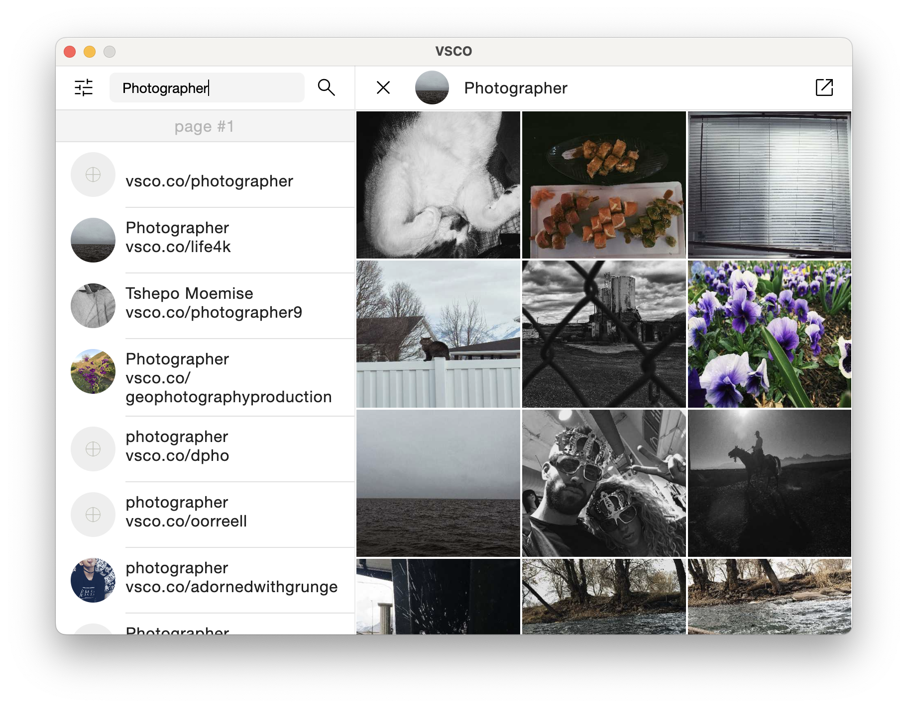

# VSCO desctop app

A simple photo viewer app for VSCO social network

## Features
- Search users
- Customizable search filters
- Download photos

## Installation

### Windows

Well, it's too easy. [Download](https://google.com/) and install the latest app....enjoy!

### MacOS

Unfortunately, apple 💩  was forbidden to install unlicensed programs on new versions of MacOS,
so until I pay $ 99 (and I don’t pay), the program will not be installed.

However! You can build the project yourself, for this you need to download the latest version
[IntelliJ IDEA](https://www.jetbrains.com/idea/), clone this project and run the build.
Not a very fast and convenient way, but it is the only one (

## License

[GPL-3.0 license](https://github.com/tompadz/VSCODesctopClient/blob/master/LICENSE.md)

**Free Software, Hell Yeah!**
